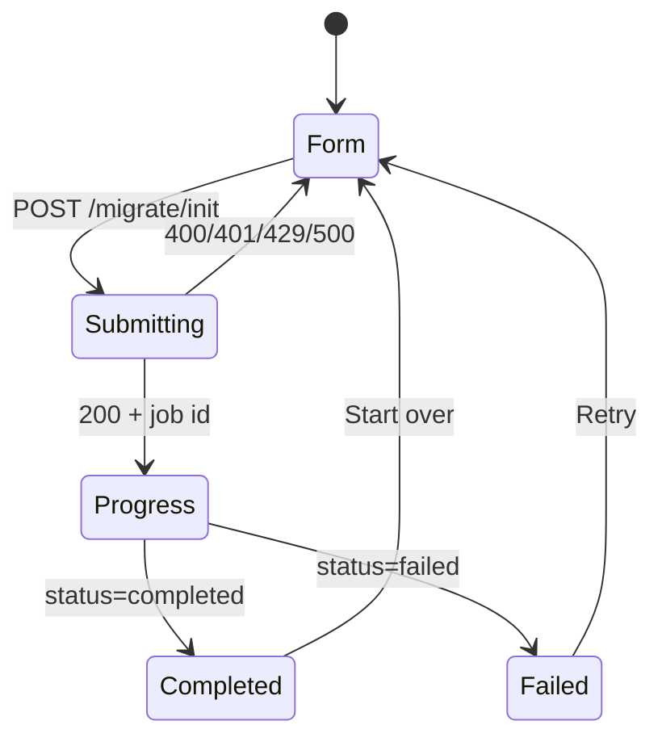

# Frontend: Migrate API — Single Page Spec

One page, one flow:

1. User enters **both** account credentials (TV Time + Serializd).
2. Frontend calls **`POST /migrate/init`** (credentials are validated synchronously before the job is queued).
3. Frontend tracks progress via **SSE** (preferred) or **polling**.
4. Show a **stepper + live counters + summary** until `status` is `completed` or `failed`.

No auth token is required. Credentials are sent once in the init body and are not returned in progress responses.

---

## Base URL & CORS

| Setting | Value |
|--------|--------|
| Default API base | `http://localhost:8080` (see `API_HOST_PORT` in `.env.example`) |
| Content-Type | `application/json` on POST |
| CORS | Set `CORS_ALLOWED_ORIGINS` to your frontend origin (comma-separated). If empty, browser cross-origin calls are blocked. |
| Credentials | `AllowCredentials: false` — no cookies/session auth |

---

## Endpoints

### 1. Start migration

```
POST /migrate/init
```

**Rate limited** per client IP (default ~6 req/min, burst 3).  
**Request timeout:** 60s (includes credential validation + queueing).

**Request body:**

```json
{
  "tvtime_email": "user@example.com",
  "tvtime_password": "secret",
  "serializd_email": "user@example.com",
  "serializd_password": "secret",
  "dump": {
    "enabled": false,
    "format": "json"
  }
}
```

| Field | Required | Notes |
|-------|----------|-------|
| `tvtime_email`, `tvtime_password` | yes | |
| `serializd_email`, `serializd_password` | yes | |
| `dump.enabled` | no | If `true`, saves a TV Time export snapshot during migration |
| `dump.format` | no | `"json"` \| `"csv"` \| `"both"` (default `"json"` if enabled) |

**Success `200`:**

```json
{ "id": "550e8400-e29b-41d4-a716-446655440000" }
```

**Errors:**

| Status | When | Body |
|--------|------|------|
| `400` | Invalid JSON, missing fields, bad dump format | `{ "error": "..." }` |
| `401` | Credential validation failed at init | `{ "error": "TV Time login failed: ..." }` or `"Serializd login failed: ..."` |
| `429` | Rate limit | `{ "error": "too many requests" }` + `Retry-After: 60` header |
| `500` | Server error starting job | `{ "error": "failed to start migration" }` |

---

### 2. Get progress (polling)

```
GET /migrate/init/{id}
```

Poll every **3–5s** if not using SSE. No rate limit on this route.

**Success `200`:** full progress object (see schema below).

**Errors:**

| Status | Body |
|--------|------|
| `400` | `{ "error": "invalid job id" }` |
| `404` | `{ "error": "migration job not found" }` |

Stop polling when `status` is `"completed"` or `"failed"`.

---

### 3. Stream progress (SSE — recommended)

```
GET /migrate/init/{id}/stream
```

**Response:** `Content-Type: text/event-stream`  
**Timeout:** up to 30 minutes.

**Events:**

| Event | When | `data` |
|-------|------|--------|
| `progress` | Progress changed | Full progress JSON |
| `error` | Job not found | `{ "error": "job not found" }` |
| (comment) | Heartbeat every ~500ms | `: heartbeat` (ignore) |

**Client parsing:** read lines; handle `event: progress` + `data: {...}`.  
Stream closes automatically when `status` is `"completed"` or `"failed"`.

**Fallback:** if the stream drops mid-job, call `GET /migrate/init/{id}` once for final state.

**Browser example:**

```javascript
const es = new EventSource(`${API_BASE}/migrate/init/${jobId}/stream`);

es.addEventListener("progress", (e) => {
  const progress = JSON.parse(e.data);
  updateUI(progress);
  if (progress.status === "completed" || progress.status === "failed") {
    es.close();
  }
});

es.addEventListener("error", (e) => {
  // SSE connection error — fall back to polling GET /migrate/init/{id}
});
```

---

## Progress response schema

```typescript
type StepStatus = "pending" | "running" | "done" | "wrong_credentials" | "error";
type JobStatus = "queued" | "running" | "completed" | "failed";

interface MigrateProgress {
  job_id: string;
  status: JobStatus;
  current_step: number;           // 1–5
  current_activity?: string;      // human-readable “now doing X”
  queue?: {
    position?: number;            // 1-based queue position (when queued)
    ahead?: number;               // jobs ahead of this one
    running_slots_used?: number;
    running_slots_max?: number;   // default 4, max 5
    estimated_wait_seconds?: number;
  };
  tvtime_login: { status: StepStatus; message?: string };
  serializd_login: { status: StepStatus; message?: string };
  gather_shows: {
    status: StepStatus;
    phase?: "follows" | "watches" | "episodes" | "dump";
    total?: number;
    done?: number;
    remaining?: number;
    message?: string;
  };
  check_existing: {
    status: StepStatus;
    total?: number;
    done?: number;
    remaining?: number;
    skipped?: Array<{ name: string; tvdb_id?: number }>;
  };
  import_shows: {
    status: StepStatus;
    total?: number;
    done?: number;
    remaining?: number;
    not_found?: Array<{ name: string; tvdb_id?: number }>;
  };
  summary: {
    status: StepStatus;
    total_tvtime?: number;
    already_in_serializd?: number;
    newly_added?: number;
    not_found?: number;
    export_id?: string;           // present if dump.enabled was true
  };
  logs: string[];                 // append-only event log
}
```

---

## Job lifecycle & UI mapping

### Top-level `status`

| Status | Meaning | UI |
|--------|---------|-----|
| `queued` | Waiting for a worker slot | Show queue position + ETA from `queue` |
| `running` | Active migration | Stepper + progress bars |
| `completed` | Success | Summary card |
| `failed` | Stopped with error | Error state + last `logs` entry |

### Steps (`current_step`)

| Step | Label | Driven by field |
|------|-------|-----------------|
| 1 | TV Time login | `tvtime_login` |
| 2 | Serializd login | `serializd_login` |
| 3 | Gather shows | `gather_shows` |
| 4 | Check existing + import | `check_existing` then `import_shows` (import runs while `current_step` may still be `4`) |
| 5 | Summary | `summary` |

**Important:** After init succeeds, the job often starts as:

- `status: "queued"`
- `current_step: 2`
- `tvtime_login.status` & `serializd_login.status`: already `"done"` (validated at init)

So the stepper should rely on **each step’s `status`**, not only `current_step`.

### `gather_shows.phase` labels (for sub-progress)

| Phase | Display |
|-------|---------|
| `follows` | TV Time follows |
| `watches` | Watch history (`done` = record count) |
| `episodes` | Episode details |
| `dump` | Saving TV Time dump (only if `dump.enabled`) |

### Queue UI (when `status === "queued"`)

Show:

- `queue.position` — position in line
- `queue.ahead` — jobs ahead
- `queue.running_slots_used / queue.running_slots_max` — e.g. `2/4`
- `queue.estimated_wait_seconds` — format as mm:ss or “~5m”
- `current_activity` — e.g. `"Waiting in migration queue (position 2, 3 ahead, ~4m)…"`

---

## Suggested page states



### Form view

- 4 credential fields (email + password × 2)
- Optional checkbox: “Save TV Time dump” → reveals format select (`json` / `csv` / `both`)
- Submit button with loading state (init can take several seconds)

### Progress view

- 5-step stepper with icons from step `status`: pending ○, running …, done ✓, error ✗
- `current_activity` as subtitle
- Progress bars for `gather_shows`, `check_existing`, `import_shows` using `done/total`
- Collapsible `logs` tail (last ~10 lines)
- Optional lists: `check_existing.skipped`, `import_shows.not_found`

### Completed view

From `summary`:

- Total TV Time shows
- Already in Serializd
- Newly added
- Not found

If `summary.export_id` is set, offer download links:

```
GET /tvtime/export/{export_id}/download?format=json
GET /tvtime/export/{export_id}/download?format=csv
```

(no auth; use `format=json` or `format=csv` only, not `both`)

### Failed view

- Show `status: "failed"`
- Last relevant `logs` entry
- If a login step has `wrong_credentials`, highlight that credential field on retry

---

## Example progress snapshots

### Queued

```json
{
  "job_id": "550e8400-e29b-41d4-a716-446655440000",
  "status": "queued",
  "current_step": 2,
  "current_activity": "Waiting in migration queue (position 1, 4 ahead, ~6m)…",
  "queue": {
    "position": 1,
    "ahead": 4,
    "running_slots_used": 4,
    "running_slots_max": 4,
    "estimated_wait_seconds": 360
  },
  "tvtime_login": { "status": "done" },
  "serializd_login": { "status": "done" },
  "gather_shows": { "status": "pending" },
  "check_existing": { "status": "pending" },
  "import_shows": { "status": "pending" },
  "summary": { "status": "pending" },
  "logs": ["TV Time credentials verified", "Serializd credentials verified"]
}
```

### Running (importing)

```json
{
  "status": "running",
  "current_step": 4,
  "current_activity": "",
  "gather_shows": { "status": "done", "total": 142, "done": 142 },
  "check_existing": { "status": "done", "total": 142, "done": 142, "skipped": [] },
  "import_shows": { "status": "running", "total": 98, "done": 45, "remaining": 53, "not_found": [] },
  "summary": { "status": "pending" },
  "logs": ["...", "Gathered 142 shows from TV Time", "..."]
}
```

### Completed

```json
{
  "status": "completed",
  "current_step": 5,
  "summary": {
    "status": "done",
    "total_tvtime": 142,
    "already_in_serializd": 44,
    "newly_added": 91,
    "not_found": 7
  },
  "import_shows": {
    "status": "done",
    "total": 98,
    "done": 98,
    "not_found": [{ "name": "Some Obscure Show", "tvdb_id": 12345 }]
  },
  "logs": ["...", "Migration complete: 142 total, 44 already in Serializd, 91 newly added, 7 not found"]
}
```

---

## Frontend implementation notes

1. **Prefer SSE over polling** — fewer requests, updates only when progress changes (~500ms poll server-side).
2. **Init is synchronous** — show a spinner on submit; both logins happen before `200`.
3. **Do not persist passwords** — clear fields after submit; optionally keep `job_id` in sessionStorage to resume progress view on refresh.
4. **Resuming a job** — if user refreshes with a saved `job_id`, open SSE or poll `GET /migrate/init/{id}`.
5. **Rate limit UX** — on `429`, disable submit for 60s and show `Retry-After`.
6. **No separate `/tvtime/login` or `/serializd/login`** needed for this page — migrate init handles everything.
7. **Swagger** — full OpenAPI at `docs/swagger.yaml` / `docs/swagger.json` in the repo.

---

## Minimal happy-path sequence

```
POST /migrate/init
  → { "id": "<uuid>" }

GET /migrate/init/<uuid>/stream   (or poll GET /migrate/init/<uuid>)
  → progress events until status ∈ { completed, failed }
```
